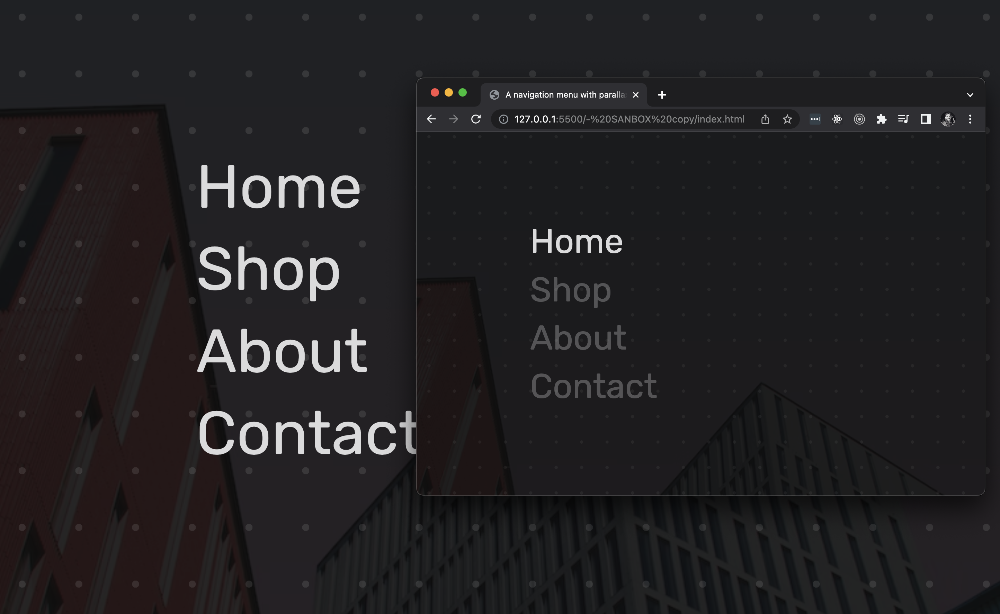

## Menu with parallax effect.

> A fancy gradient and image position manipulation based on `dataset` changes.



Featuring:

- Hover affect lights up only actively hovered `nav-item` between siblings.
- The `clamp` property gives a very fluid response in font-size, margin padding.

The `clamp` CSS function clamps a middle value within a range of values between
a defined minimum bound and a maximum bound. The function takes 3 parameters: a
minimum value, a preferred value, and a maximum allowed value.

- With `>` we select all `div` child elements where the parent is our `<nav>`.

```css
##navbar {
  height: 100vh;
  width: 100vw;
  display: flex;
  align-items: center;
}

#nav-items {
  position: relative;
  margin-left: clamp(4rem, 20vw, 48rem);
  z-index: 2;
}

.nav-item {
  font-family: "Rubik", sans-serif;
  color: rgb(224, 224, 224);
  font-size: clamp(3rem, 6vw, 8rem);

  display: block;
  text-decoration: none;
  padding: clamp(0.35rem, 0.5vw, 1.2rem) 0rem;
  transition: opacity 0.3s ease;
}
/* Reduce opacity when whole nav is hovered */
#nav-items:hover > .nav-item {
  opacity: 0.3;
}
/* Override opacity on current/active hovered child */
#nav-items:hover > .nav-item:hover {
  opacity: 1;
}
```

- As we hover each/any `nav-item` we want to pan a background gradient.

```html
<div id="container">
  <nav id="navbar">
    <div class="nav-item" href="/">Home</div>
    <div class="nav-item" href="/">Shop</div>
    <div class="nav-item" href="/">About</div>
    <div class="nav-item" href="/">Contact</div>
  </nav>
  <!-- Here! -->
  <div class="panned-pattern"></div>
</div>
```

- With `~` selects every child element that is preceded by a `<nav>` element.

```css
#background-pattern {
  height: 100vh;
  width: 100vw;
  background-image: radial-gradient(
    rgba(255, 255, 255, 0.1) 9%,
    transparent 9%
  );
  /* You need position so pattern can snap back in origin */
  background-position: 0% 0%;
  background-size: 9vmin 9vmin;
  /* Absolutely positioned behind and relative to nav-items */
  position: absolute;
  top: 0px;
  left: 0px;
  z-index: 1;

  transition: opacity, background-size, background-position, 0.8s ease;
}
/* Here we can reduce the pattern size when we hover nav-items: */
/* Remember to add transition so the change is smoothly done 🧙‍♂️. */
#nav-items:hover ~ #background-pattern {
  background-size: 7vmin 7vmin;
  opacity: 0.5;
}
```

- Convert HTML collection to array with `Array.from` to assist with iterations.

- We append a listener and `data` attribute with `dataset` to each item.

```js
// Your scripts :)
const navbar = document.getElementById("navbar");
const navItem = document.getElementsByClassName("nav-item");
console.log(navbar, navItem);
// Notice in css we selector & provide css properties by `data-active-index`.
// Each item's index has a position change that shifts the pattern.
Array.from(navItem).forEach((item, index) => {
  item.onmouseover = () => {
    navbar.dataset.activeIndex = index;
  };
});
```

- The selectors are wired up to position depending on the `data-active-index`.

- Triggering our **absolutely** positioned pattern & image to adjust as needed.

```css
#navbar[data-active-index="0"] > #background-pattern {
  background-position: 0% -25%;
}
#navbar[data-active-index="1"] > #background-pattern {
  background-position: 0% -55%;
}
#navbar[data-active-index="2"] > #background-pattern {
  background-position: 0% -75%;
}
#navbar[data-active-index="3"] > #background-pattern {
  background-position: 0% -100%;
}
#navbar[data-active-index="0"] > #background-image {
  background-position: center 45%;
}
#navbar[data-active-index="1"] > #background-image {
  background-position: center 50%;
}
#navbar[data-active-index="2"] > #background-image {
  background-position: center 55%;
}
#navbar[data-active-index="3"] > #background-image {
  background-position: center 60%;
}
```

Regards, <br />
Luigi Lupini <br />
<br />
I ❤️ all things (🇮🇹 / 🛵 / ☕️ / 👨‍👩‍👧)<br />
